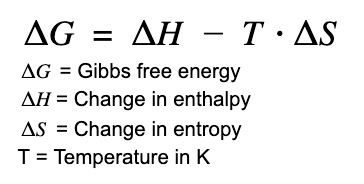
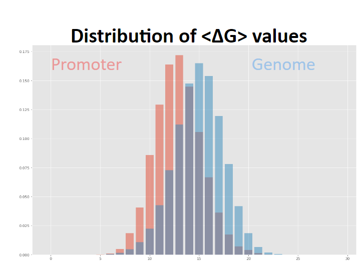

pHunt user manual
=================

Introduction
------------

###What is pHunt?
**pHunt** is a python coded program based on the PhiSite promoter hunter, coded in perl.
Using multiple sources of information regarding the holoenzyme's binding affinity, pHunt scans bacterial genomes
looking for the -35 and -10 sequences that characterize bacterial promoters, evaluates the thermodynamic instability of the surrounding regions of the putative promoter, and reports hits sorted by final score, a summation of *PSSM scores* and *Gibbs Free Energy* (**GibbsFE**) contributions.

Reported hits are sites predicted to be promoters within the bacterial genome, with a higher final score corresponding to an increased likelihood of a site being an actual promoter.

To see the performance of the program, consult `benchmarking.md`

###Why use pHunt?

Hunting for promoters is useful for a variety of reasons, including complementing transcriptional regulatory network analysis and experimental promoter validation.

There are relatively few alternative promoter hunters available. Many Promoter Hunters, such as [Sapphire](https://sapphire.biw.kuleuven.be)
 and [BacPP](http://www.bacpp.bioinfoucs.com/home),
 are trained using machine learning on organism-specific datasets, leaving a gap for generic promoter hunters that work across many organisms.

The PhiSite (**PS**) Promoter Hunter is an example of one of these generic promoter hunters. The pHunt Promoter Hunter was made to convert PS into a python program, implement several logical changes, and increase customizability by the user.

###Why use Gibbs Free Energy?
[Gibbs Free Energy](http://hyperphysics.phy-astr.gsu.edu/hbase/thermo/helmholtz.html)
 is defined as the thermodynamic potential of a closed system, related to the maximum amount of work done by the system.

Change in Gibbs Free Energy is often associated with the following equation:

where an increase in entropy and a decrease in enthalpy are associated with spontaneity.

In this program, Change in Gibbs Free Energy of melting in DNA sequences is explored.

The point in exploring change in GibbsFEmelting in the genome is that certain locations will more spontaneously melt or unzip due to a lower thermodynamic potential while open or a higher thermodynamic potential while closed (making it relatively easier to unzip). The region around the holoenzyme's binding sites tend to have a lower change in GibbsFEmelting to assist in the enzyme's unzipping of the surrounding sequence to initiate transcription. An example of the difference in change in GibbsFEmelting between promoter regions and non-promoter regions can be shown through the histogram below.

The histogram uses a dataset acquired from E. coli, with the histogram on the left being promoter regions and the histogram on the right being non-promoter regions. Each promoter and non-promoter sequence was converted into a Gibbs Free Energy value by translating the region's dinucleotides into a Gibbs Free Energy contribution and averaging over a window size, creating an array of averaged Gibbs Free Energy values reflecting the thermodynamic instability of the promoter sequences or non-promoter sequences. These average values were then sorted into bins of differing GibbsFE value ranges. The frequencies of promoters/non-promoters within these bins are reflected on the y axis. On the x axis, the bins are sorted in ascending order of average Gibbs Free Energy value.

As shown above, promoters tend to have a lower average Gibbs Free Energy than non-promoters.

As a result, Gibbs Free Energy is used in conjunction with PSSMs to rank potential promoter regions.

###Differences between PhiSite Promoter Hunter?
There are several changes made in pHunt that were not in the PhiSite Promoter Hunter. *Note*: All of these options are configurable.

* Computes Final Score as the summation of Log-Likelihood Ratios instead of normalized values using arbitrary coefficients
* Decreases the range around the -10 sequence where the Gibbs Free Energy is taken
* Makes the pseudocount value in the PSSM Log-Likelihood Ratio constant as opposed to dependent on the base pair frequency of the input sequence

###The move from a sum of normalized values to a sum of Log-Likelihood Ratios
PS calculates Final Score as the summation of normalized values with arbitrary coefficients applied. The Final Score is pictured below:

Computing Final Score in this manner is suboptimal for a variety of reasons. Firstly, weighting of Gibbs Free Energy or the PSSM scores by applying any coefficient to their normalized values would be arbitrarily determined. Secondly, normalization of the two PSSM scores ignores any difference in the amount of information content provided by either of the motifs.

There is a non-arbitrary way to sum the contributions of the PSSMs and Gibbs Free Energy. The PSSM scores are already computed as log-likelihood ratios. If the Gibbs Free Energy metric was converted into a Log-Likelihood Ratio, summation of these three values would be a resolution to this problem of computing the Final Score.

By training the program on datasets of promoters and non-promoters converted to Gibbs Free Energy distributions, Gibbs Free Energy is successfully converted into a Log-Likelihood Ratio. The revised Final Score is pictured below

> Note: Final Score can be computed in both the normalized and LLR manner in the program. The performance difference between these parameters is investigated in `benchmarking.md`

Overview of program
-------------------

###Preparing the json file
pHunt uses the `settings.json` as the file by which to customize parameters. The program intializes several variable by references files and values present in this json.

The recommended parameters are already in place in the `settings.json` file in the Github repository

The json file with parameters that mimic the PhiSite Promoter Hunter is available in the Github repository as `settings-PhiSite.json`. In order to use this json file in the program, please remove the other `settings.json` file and rename the `settings-Phisite.json` file to `settings.json`

For information about the json file and the function of each parameter, check out `settings.md`

###Preparing the GibbsFE likelihood estimates
In order to convert the average Gibbs Free Energy of the area around a putative promoter into a Log-Likelihood Ratio, promoter and non-promoter sequences must be fed into the program. The program  must generate a positive and negative set likelihood estimate from this data in order to begin to convert GibbsFE into an LLR.

####Creating the GibbsFE moving average array
The first stage of this transformation from sequence to likelihood-estimate involves the translation of dinucleotides into Gibbs Free Energy values. Dinucleotides and trinucleotides have Delta G values that describe their thermodynamic instability or willingness to unzip. The Gibbs Free Energy values for Dinucleotides/trinucleotides are provided in a csv file specified in the json.

Iterating through promoter/non-promoter sequences using a step size of 1, an array of dinucleotides/trinucleotides (depending on whether the user has dinucleotide or trinucleotide GibbsFE contributions in the csv file) is generated. This array is converted into a list of Delta G values using the GibbsFE csv file (For more information on this, check out `settings.md`). Finally, these values are smoothed as the energy array is converted into a moving average array by averaging across a window size dictated by the user with a step size of one. This is done with both the promoter and non-promoter set to create the positive and negative moving average vectors.

####Binning the GibbsFE moving average array
Using the `numpy` library, bins that cover delta G values ranging from the lowest possible value to the highest possible value are constructed, with the amount of bins customizable by the user. The elements of the moving average vector are then placed in these bins based on the value of the element and the range of the bin. This creates an array listing the counts of vector values in each bin and an array listing the edges (range) of each bin.

Note: Separate bins and arrays are created for the positive and negative set

To create a likelihood estimate from an array of counts, a pseudocount value is added to account for the difference between probability and frequency, and the counts of each array are divided by the total amount of counts within the GibbsFE bins. The program has now created a positive and negative likelihood estimate.

###Predicting Promoter regions
In order to predict promoter regions, pHunt scores the whole input sequence with the left and right motif (-35 and -10 respectively).

####Finding hits that pass the score threshold
Beginning with the left position, pHunt restricts potential locations of the left motif by setting a limit for its most downstream location (must have space for the minimum length of the spacer and the right sequence). Each left motif position between 0 and the limit is scored using the left generated pssm. Left motif positions with scores above the threshold (adjustable by the user) proceed to the next step.

Taking into account the minimum and maximum spacer values between the left and right sequences, potential locations of right sequences  are then considered for each left motif position. Only right sequences with scores above the right threshold will pass. As a result, hits are now generated with a left position (score > left threshold), a specific spacer length, and a right position (score > right threshold).

####Finding GibbsFE contribution
A double averaging technique is used to get an average of Gibbs Free Energy around the -10 motif so that information from surrounding sequences smoothes the GibbsFE value.

This is done by first generating a moving average GibbsFE array from the input sequence (a smoothed array of delta G values) using a window size specified by the user. When a potential hit passes the left and right thresholds, the program calculates an left range (distance to the left of the -10 motif where the Gibbs Free Energy likelihood is evaluated across) and a right range (distance to the right of the -10 motif where the Gibbs Free Energy likelihood is evaluated across).

Left range is calculated as the sum of the distance to the left of the -10 sequence where unzipping occurs (lerg - Customizable by the user), a left shift calculated as half of the window size to account for the first averaging, and the length of the right motif. Right range is calculated as the sum of the distance to the right of the -10 sequence where unzipping occurs (rerg - Customizable by the user), a left shift calculated as half of the window size to account for the first averaging, and the length of the right motif. The equation used in the program is pictured below.

As shown above, the ranges are also bounded so as to prevent the ranges from surpassing the indices of the moving average array.

These ranges are used as indices in the moving average array to extract a smaller array of GibbsFE values (obtained from the moving average vector) around the -10 motif and average them again to generate a single value. The result is a double averaged Gibbs Free Energy value that reflects the instability of the sequence around the -10 motif and the likelihood by why the holoenzyme unravels the sequence around the putative -10 motif.

####Calculating the LLR Final Score
If the program is set to the LLR mode for computing the final score, it will use the double averaged Gibbs Free Energy value to find a bin in the positive likelihood estimate with an appropriate GibbsFE range and a bin in the negative likelihood estimate with an appropriate GibbsFE range. The frequency in the found positive bin is divided by the frequency in the found negative bin, creating a ratio of frequencies. The logarithm is taken to generate a log-likelihood ratio.

In hits that pass the two thresholds, the left PSSM score is calculated, the right PSSM score is calculated, and the GibbsFE LLR is calculated. This three values are summed to calculate the final score. Through this process, hits are generated for an input sequence, sorted by final score, and displayed in the output file.

####Calculating the normalized Final score
If the program is set to the norm mode for computing the final score, it will use the double averaged Gibbs Free Energy value to compute a normalized Gibbs Free Energy value by calculating a minimum GibbsFE value and a maximum GibbsFE value and performing the following equation:

The program will then compute the normalized PSSM scores using the same equation.

In hits that pass the two thresholds, the final score will then be taken as the summation of the left normalized PSSM score, the right normalized PSSM score, and 2 * the normalized GibbsFE score. Through this process, hits are generated for an input sequence, sorted by final score, and displayed in the output file.

Note: The choice of coefficients was made by the PS program.

####Removing duplicates
When promoter hunting, duplicate hits appear, especially at lower thresholds. duplicate hits are defined as two hits with the same -35 or -10 position but different spacer lengths. To remove duplications, the program looks for hits for an input sequence with the same -35 or -10 position and removes the lower scoring hit. The result is a list of hits for a sequence with unique -10 and -35 sequences.

###Generating the Output file
After promoter hunting, the program generates a csv file with the hits for each sequence inputted. The csv file can either contain all the hits for each input sequence or just the top hits for each input sequence. The information stored for each hit is as follows:

*For the LLR mode:
>['ID','Spacer_length','Range','Left_Motif_Score','Right_Motif_Score','Average_GibbsFE','GibbsFE_Log-Likelihood','Final_Score', 'Promoter_Sequence']

*For the norm mode:
>['ID','Spacer_length','Range','Left_Motif_Score','Right_Motif_Score','Average_GibbsFE','Final_Score', 'Promoter_Sequence']

The output file may be named whatever deemed by the user, as long as the extension is .csv. The output file will be generated in the data folder.
