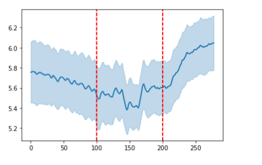
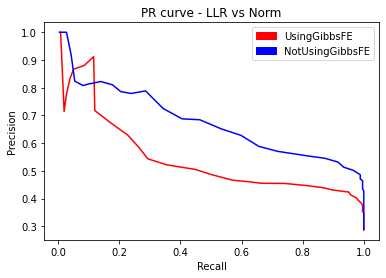

Note to myself: Make sure to deal with unzip dist in pHunt

As discussed in `user_manual.md`, several changes were made in **pHunt** that were not offered in the **Phisite Promoter Hunter**, including calculating the final score as a summation of Log-Likelihood Ratios and using a smaller window size to compute Gibbs Free Energy.

The following document seeks to explore the performance effects of some of these changes

# About the Test Set
The test set is the set of sequences where pHunt will hunt for promoters. By evaluating the **True Positives** made by the program and the **Condition Positives** in the test set at various thresholds, the software's performance can be evaluated with different parameters.

Each sequence within the test set contained a 300 bp segment within the E. coli genome, where the middle 100 bp is a known Promoter Segment.

A True Positive is a hit within the middle 100 bp of a sequence in the test set (-35 and -10 sequences are between the 100th base pair and the 200th base pair). The test set is composed of 67% Condition Negatives and 33% Condition Positives.

# Calculating Precision and Recall
**Precision** is defined as the number of true positives divided by the number of positives reported by the program.

Precision will be calculated on hits made by the program at various thresholds for the `Final Score` (Check out `User_manual.md`)

For our use, positives will be considered to be any hit above the Final Score threshold. True positives will be any hit above the threshold that is located within the middle of the test set sequences

**Recall** is defined as the number of true positives divided by the number of **Condition Positives**.

Recall will be calculated on hits made by the program at various thresholds for the `Final Score` (Check out `User_manual.md`)

For our use, each sequence within the test set will have one Condition Positive, located within the middle 100 base pairs of the sequence. If the program reports a hit above the threshold that is located anywhere within the middle 100 base pairs of a sequence, the program is considered to have found the true positive for that sequence. A recall value of 1.0 is achieved when the program reports at least one hit within the middle of each test set sequence.

# Performance Evaluations
The following performance evaluations were conducted with the default parameters available at `settings.json`, unless specified otherwise.

## Comparing pHunt's default parameters vs PhiSite pHunt Settings
For pHunt's default parameters, the parameters available in `settings.json` were used

For PhiSite pHunt settings, the parameters available in `settings-PhiSite.json` were used

We suspect pHunt with its default parameters to perform better than pHunt with Phisite settings due to the fact that we except a final score of Log-Likelihood ratios (non-arbitrary) to perform better than a final score of normalized values (arbitrary), and we except a smaller Gibbs Free Energy window size to better reflect the localized dips in Gibbs Free Energy in the sequences within the test set

**pHuntsettings AUC: 0.53722**

**PhiSitesettings AUC: 0.58431**

As shown in the PR curve above, our expectations are not completely reflected in the data. Although pHunt_settings possesses a higher precision value than PhiSite_settings from a recall range of 0.0 to 0.3, PhiSite_settings possess a higher precision value than pHunt_settings over a recall range of 0.3 to 1.0. Why is this? The following performance evaluations explore the performance impacts of each parameter that is different between pHunt_settings and PhiSite_settings.

### Calculating Final Score as the summation of Log-Likelihood Ratios vs the summation of normalized values
To compare the two final score methods within the algorithm, the default parameters are used, except `mode_fscr` which dictates whether normalization or Log-Likelihood Ratio summation is used.

We expect pHunt with a final score computed as the summation of Log-Likelihood Ratios to perform better than a pHunt with a final score computed as the summation of normalized values.

**LLR_finalscore AUC: 0.53722**

**norm_finalscore AUC: 0.43397**

As we suspected, LLR_finalscore performs better than normalized_finalscore with a higher AUC and precision values that are higher than normalized_finalscore at the same recall value. This is what we suspected in `User_manual.md`; Normalizing PSSM scores and Gibbs Free Energy contributions does not make sense since the coefficients are arbitrary and normalizing PSSM scores disregards differences in information content between the two PSSMs. This difference in final score computation did not cause the surprise seen above between PhiSite pHunt and default pHunt

### Smaller Gibbs Free Energy window vs Larger Gibbs Free Energy window
The PhiSite Promoter Hunter uses a range (lrange and rrange are discussed in `User_manual.md`) larger than 100 bp when computing the Gibbs Free Energy around a hit.

Based on performed analysis of 100 bp promoter sequences, the dip in Gibbs Free Energy within the promoter sequence is localized within less than 25 bp. The following graph reflects the average Gibbs Free Energy of the test set sequences across different base pair positions, using a moving average of 25 base pairs. The ligher blue line represents the standard deviation.

As seen above, the dip in Gibbs Free Energy is localized from around the 150th bp to the 175th bp.

A smaller Gibbs Free Energy window was used in the default parameters. We expect a smaller window size to perform better than a larger window size due to a smaller window size better reflecting the dip in Gibbs Free Energy.

**normal_GibbsFEwindow AUC: 0.53722**

**smallvslargewsize AUC: 0.47667**

As expected, a smaller window size better recognizes the dip in Gibbs Free Energy present within promoter sequences and is recommended over PhiSite's large window size. This difference in window size did not cause the surprise seen above between PhiSite pHunt and default pHunt

### Equal Frequency Null vs GC Content Null
As discussed in `User_manual.md`, the PhiSite promoter hunter uses the GC content of the inputted sequence when computing the PSSM Log-likelihood ratio while pHunt's default settings use an equal frequency of each base pair for the PSSM's null hypothesis.

**equalfrequency_null: 0.53722**

**GCcont_null: 0.73572**

Using a GC content null hypothesis when computing PSSM scores seem to account for the surprise seen between pHunt default settings and PhiSite settings.

## The Performance Impact of Gibbs Free Energy
The rationale for using Gibbs Free Energy was presented in `User_manual.md`. The performance impacts are explored below

**UsingGibbsFE: 0.53722**

**NotUsingGibbsFE: 0.73572**

This was not expected. Gibbs Free Energy should reflect the regions where the holoenzyme is likely to unzip, and therefore, regions likely to be promoters. This data may suggest information provided by Gibbs Free Energy may overlap with information provided by the PSSMs. 
