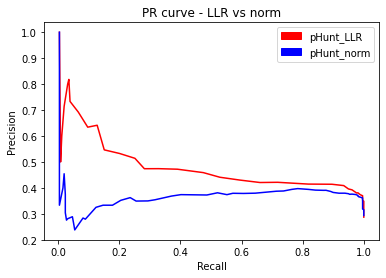
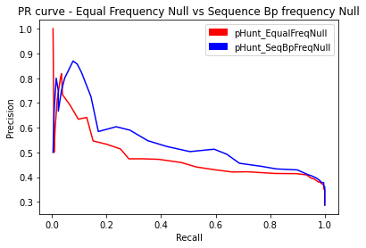

As discussed in `user_manual.md`, several changes were made in **pHunt** that were not offered in the **Phisite Promoter Hunter**, including calculating the final score as a summation of Log-Likelihood Ratios and using motif pseudocount values that did not depend on the base pair frequency of the inputted sequence.

The following document seeks to explore the performance effects of some of these changes

# About the Test Set
The test set is the set of sequences where pHunt will hunt for promoters. By evaluating the **True Positives** made by the program and the **Condition Positives** in the test set at various thresholds, the software's performance can be evaluated with different parameters.

Each sequence within the test set contained a 300 bp segment within the E. coli genome, where the middle 100 bp is a known Promoter Segment.

A True Positive is a hit within the middle 100 bp of a sequence in the test set (-35 and -10 sequences are between the 100th base pair and the 200th base pair). The test set is composed of 67% Condition Negatives and 33% Condition Positives.

# Calculating Precision and Recall
**Precision** is defined as the number of true positives divided by the number of positives reported by the program.

Precision will be calculated on hits made by the program at various thresholds for the `Final Score` (Check out `User_manual.md`)

For our use, positives will be considered to be any hit above the Final Score threshold. True positives will be any hit above the threshold that is located within the middle of the test set sequences

**Recall** is defined as the number of true positives divided by the number of **Condition Positives**.

Recall will be calculated on hits made by the program at various thresholds for the `Final Score` (Check out `User_manual.md`)

For our use, each sequence within the test set will have one Condition Positive, located within the middle 100 base pairs of the sequence. If the program reports a hit above the threshold that is located anywhere within the middle 100 base pairs of a sequence, the program is considered to have found the true positive for that sequence. A recall value of 1.0 is achieved when the program reports at least one hit within the middle of each test set sequence.

# Performance Evaluations
The following performance evaluations were conducted with the default parameters available at `settings.json`, unless specified otherwise. Please note, the following document is organized so that it may explore the performance differences between the PhiSite promoter hunter and pHunt. After, the document decouples the parameters to explore the performance impacts of each parameter that is different between the PhiSite Promoter Hunter and pHunt.

## Comparing pHunt's default parameters vs PhiSite pHunt Settings
For pHunt's default parameters, the parameters available in `settings.json` were used

For PhiSite pHunt settings, the parameters available in `settings-PhiSite.json` were used

We suspect pHunt with its default parameters to perform better than pHunt with Phisite settings primarily due to the fact that we expect a final score of Log-Likelihood ratios (non-arbitrary) to perform better than a final score of normalized values (arbitrary)

**pHunt_settings AUC: 0.47667**

**PhiSite_settings AUC: 0.37643**

As shown in the PR curve above and the AUC measurements, our expectations are reflected in the data: using the default pHunt settings yields superior performance. However, how does each parameter change impact the performance? The following performance evaluations explore the performance impacts of each parameter that is different between pHunt_settings and PhiSite_settings.

### Calculating Final Score as the summation of Log-Likelihood Ratios vs the summation of normalized values
To compare the two final score methods within the algorithm, the default parameters for pHunt are used, except `mode_fscr` which dictates whether normalization or Log-Likelihood Ratio summation is used.

We expect pHunt with a final score computed as the summation of Log-Likelihood Ratios to perform better than a pHunt with a final score computed as the summation of normalized values.

**pHunt_LLR AUC: 0.47667**

**pHunt_norm AUC: 0.36195**

As we suspected, pHunt_LLR performs better than pHunt_norm with a higher AUC and precision values that are higher than pHunt_norm at the same recall values. This is what we suspected in `User_manual.md`; Normalizing PSSM scores and Gibbs Free Energy contributions does not make sense since the coefficients are arbitrary and normalizing PSSM scores disregards differences in information content between the two PSSMs. Comparing the ROC curves, this metric most likely caused the biggest difference between the performances of the PhiSite promoter hunter and pHunt.

### Equal Frequency Null vs Sequence Base Pair Frequency Null
As discussed in `User_manual.md`, the PhiSite promoter hunter uses the base pair frequency of the inputted sequence as the null hypothesis when computing the PSSM Log-likelihood ratio while pHunt's default settings use an equal frequency of each base pair for the PSSM's null hypothesis.

To compare the two null hypotheses within the algorithm, the default parameters for pHunt are used, except `use_GCcont_background` which dictates whether the base pair frequency of the inputted sequence is used or an equal base pair frequency is used when calculating PSSM scores.

**pHunt_EqualFreqNull: 0.47667**

**pHunt_SeqBpFreqNull: 0.53927**

Using a PSSM null hypothesis based on the base pair frequency provides a slight increase in performance in contrast to an equal frequency null.

Note: Tests with coding sequences as conditional negatives have shown a null based on base pair frequency to provide a high increase in performance. This is suspected to result from the higher GC content in CDS sequences and the fact that this null down-weights Guanine and Cytosine bases compared to a null based on equal base pair frequency.

### Constant pseudocount value vs Base Pair frequency pseudocount value
As discussed in `User_manual.md`, the PhiSite promoter hunter uses the base pair frequency of the inputted sequence for the pseudocount value when computing the PSSM Log-likelihood ratio while pHunt's default settings use an 0.25 pseudocount value for the PSSM's alternative hypothesis

The choice to move away from a pseudocount value based on the bp frequency of the input sequence was made as the numerator of the PSSM log-likelihood ratio (where the pseudocount value is applied to account for the difference between probability and frequency) describes the binding affinity of the TF, which should not be beholden to the base pair frequency of the surrounding region where the TF binds)

To compare the two pseudocounts within the algorithm, the default parameters for pHunt are used, except `use_GCcont_pseudocnt` which dictates whether the base pair frequency of the inputted sequence is used or an equal base pair frequency is used for the pseudocount when calculating PSSM scores.

**pHunt_ConstantPseudocount AUC: 0.47667**

**pHunt_SeqBpFreqPseudocount AUC: 0.47601**

As expected, the pseudocount value does not make much of a difference when searching for true promoter regions. It is, however, still recommended to go with a constant pseudocount value so as to obey the principle suggested earlier.

## The Performance Impact of Gibbs Free Energy
The rationale for using Gibbs Free Energy was presented in `User_manual.md`. The performance impacts are explored below with both the pHunt default settings and the PhiSite settings.

**pHunt_GibbsFE: 0.47667**

**pHunt_noGibbsFE: 0.54078**

**PhiSite_GibbsFE: 0.37643**

**PhiSite_noGibbsFE: 0.55181**

Looking at the pHunt default settings performance with and without Gibbs Free Energy, it appears as if Gibbs Free Energy does not improve performance of the program. This is unexpected. Gibbs Free Energy should reflect the regions where the holoenzyme is likely to unzip, and therefore, regions likely to be promoters. This data may suggest information provided by Gibbs Free Energy may overlap with information provided by the PSSMs.

However, for the PhiSite pHunt settings performance with and without Gibbs Free Energy, it appears as if Gibbs Free Energy hurts the performance of the program. This must be due to PhiSite's improper handling of Gibbs Free Energy via normalization.
